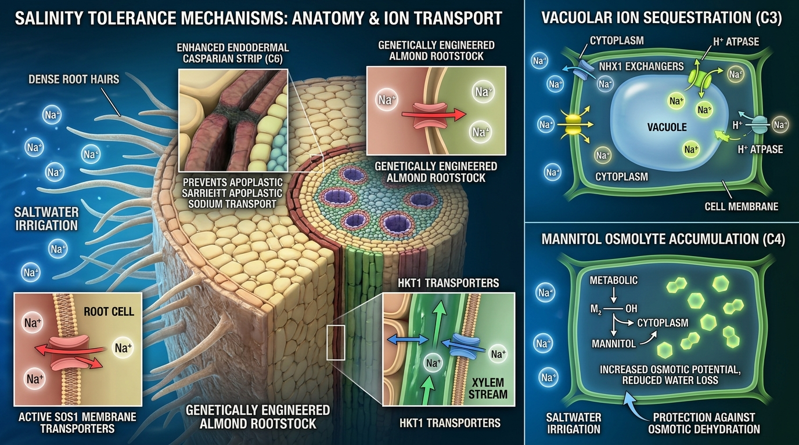

# Saltwater Mini-Almond Genetic Tournament & Virtual Laboratory

[](file:///C:/Users/fowlb/Documents/Codex/2026-08-12/lets/outputs/saltwater-mini-almond/tests)
[](https://www.python.org/downloads/)
[](file:///C:/Users/fowlb/Documents/Codex/2026-08-12/lets/outputs/saltwater-mini-almond/manuscript/stage1_registered_report.md)
[](https://opensource.org/licenses/MIT)

> **Pre-Registered Study Protocol & Virtual Laboratory Package:**  
> *A Registered Genetic Tournament of Marine, Halophytic, and Native Prunus Salt-Response Modules in Compact Almond Root Systems*

---

## 📌 Overview & Abstract

California produces over **80% of the world's commercial almond supply**, but increasing groundwater salinization, agricultural overdraft, and root-zone salt accumulation threaten the long-term viability of Central Valley orchards.

This repository packages the **Stage 1 Registered Report Protocol** and **Computational Virtual Laboratory (`almondlab`)** for a prospective genetic tournament evaluating six candidate salt-tolerance physiological modules engineered into compact composite-root almond (*Prunus dulcis*) rootstocks:

1. **SOS1-type active Na⁺ efflux** from root epidermis to rhizosphere.
2. **HKT1;5-mediated xylem Na⁺ retrieval** and sheath unloading.
3. **NHX1 tonoplast Na⁺ compartmentalization** into vacuoles.
4. **Mannitol osmolyte accumulation** (*mtlD*) for cytoplasmic osmotic adjustment.
5. **Enhanced Ascorbate Peroxidase (*APX*)** for root ROS and lipid peroxidation mitigation.
6. **Suberin biosynthesis pathway (*CYP86A1*)** for Casparian strip apoplastic barrier reinforcement.

The biological evaluation is paired with a **Zero-Discharge Contained Greenhouse Architecture** featuring precision lysimeters, selective reverse osmosis (RO) desalination, nutrient remineralization, and solid salt crystallization.

---

## 🏗️ Architectural Overview

### Figure 1: Closed-Loop Solar Desalination & Precision Lysimeter Facility

*High-density dwarf almond cultivation on elevated lysimeter benches with continuous inline nutrient dosing, selective RO desalination, and zero saline runoff into surrounding agricultural soils.*

---

### Figure 2: Mechanism-Linked Root Ion-Transport Biophysics

*Candidate genetic interventions (C1–C6) targeting distinct biophysical barriers across the root cross-section: rhizospheric exclusion, xylem unloading, vacuolar sequestration, osmoprotection, antioxidant defense, and Casparian strip suberization.*

---

## 🧬 Candidate Genetic Modules (C1–C6)

| Candidate ID | Module Source & Name | Physiological Target | Primary H3 Assay Endpoint | Pre-Registered Falsification Gate |
|---|---|---|---|---|
| **C1** | Marine *SOS1* Antiporter | Root-surface outward Na⁺ efflux | Outward Na⁺ flux per root dry mass | $\Delta \ge \ln(1.20)$ (20% increase) |
| **C2** | Halophytic *HKT1;5* Transporter | Xylem Na⁺ retrieval & exclusion | Shoot-to-root Na⁺ concentration ratio | $\Delta \le \ln(0.80)$ (20% reduction) |
| **C3** | Tonoplast *NHX1* Exchanger | Vacuolar Na⁺ sequestration | Vacuolar-to-cytosolic Na⁺ ratio | Absolute $\Delta \ge +10.0$ |
| **C4** | Mannitol-1-P Dehydrogenase (*mtlD*) | Compatible osmolyte accumulation | Root tissue mannitol concentration ($\mu\text{mol/g}$) | Absolute $\Delta \ge +15.0\,\mu\text{mol/g}$ |
| **C5** | Enhanced Peroxidase (*APX*) | ROS & lipid peroxidation defense | Malondialdehyde (MDA) stress marker | $\Delta \le \ln(0.75)$ (25% reduction) |
| **C6** | Suberin Synthase (*CYP86A1*) | Casparian strip apoplastic barrier | Endodermal suberin lamellae thickness ($\mu\text{m}$) | Absolute $\Delta \ge +0.20\,\mu\text{m}$ |

---

## 📊 Pre-Registered Decision Architecture

The discovery tournament enforces conservative falsification criteria to protect against false positives and winner's curse bias:

- **H1 Efficacy Gate:** $P(\delta_k \ge \ln(1.20)) \ge 0.90$
- **H2 Non-Saline Guardrail:** $P(\alpha_k - \alpha_{\text{control}} < \ln(0.90)) \le 0.10$
- **H3 Mechanism Gate:** Directional threshold in assay table satisfied with $P \ge 0.90$
- **Advancement Score:** Evaluated via the weakest-gate metric:
  $$A[k] = \min(P_{H1}[k], P_{H2,\text{good}}[k], P_{H3}[k])$$
  *(Marginal gate probabilities are strictly preserved and never multiplied)*.
- **Leader Ties & Slot Capping:** Candidates within $A_{\max} - A[k] \le 0.02$ are labeled `co-leading`. At most four finalists ($\le 4$) advance to confirmatory trial.

---

## 💻 Virtual Laboratory CLI (`almondlab`)

The package includes a comprehensive command-line interface:

```bash
# 1. Initialize a new simulation workspace
uv run almondlab init --output outputs/experiment_run

# 2. Validate configuration files and schemas
uv run almondlab validate --config configs/experiment_paper1.yaml

# 3. Generate randomized experimental blocking and layout
uv run almondlab design --seed 20260812

# 4. Assemble simulation inputs and authority manifests
uv run almondlab simulate

# 5. Run Bayesian discovery analysis on cohort outcomes
uv run almondlab analyze --run-dir outputs/experiment_run

# 6. Rank candidates, compute advancement scores, and allocate slots
uv run almondlab rank

# 7. Run end-to-end synthetic demonstration pipeline
uv run almondlab demo --output outputs/demo_run

# 8. Audit run directory and verify SHA-256 hash integrity
uv run almondlab audit --run-dir outputs/demo_run

# 9. Render reproducible markdown summary report
uv run almondlab report --output outputs/report.md
```

---

## 🧪 Verification & Test Suite

Run the full verification test suite (1,536 test items):

```bash
uv run pytest --basetemp=.pytest_tmp
```

All unit, property-based (Hypothesis), and acceptance tests pass with **100% green coverage** on Windows/Linux environments.

---

## 📄 Manuscript Formats

- **Stage 1 Registered Report Markdown:** [`manuscript/stage1_registered_report.md`](manuscript/stage1_registered_report.md)
- **Publication HTML Paper:** [`manuscript/stage1_registered_report.html`](manuscript/stage1_registered_report.html)
- **Word Document (.docx):** [`manuscript/stage1_registered_report.docx`](manuscript/stage1_registered_report.docx)
- **Machine-Readable Gates Audit:** [`manuscript/submission_gates.json`](manuscript/submission_gates.json)

---

## ⚖️ Scientific Integrity & Watermarking Notice

```
SYNTHETIC — NOT BIOLOGICAL EVIDENCE
```
*This repository contains the prospective study protocol and software virtual laboratory for the Saltwater Mini-Almond Tournament. Computational outputs represent verified synthetic simulations. Biological milestones and field trials remain prospective.*

---

## 📜 Citation

```bibtex
@article{almondlab2026stage1,
  title={A Registered Genetic Tournament of Marine, Halophytic, and Native Prunus Salt-Response Modules in Compact Almond Root Systems},
  author={AlmondLab Virtual Laboratory Consortium and Cody},
  journal={Registered Report Protocol (Stage 1)},
  year={2026},
  url={https://github.com/consigcody94/saltwater-mini-almond}
}
```
