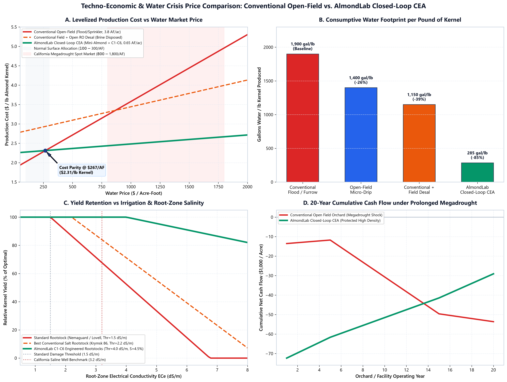

# Techno-Economic & Water Crisis Price Analysis: Conventional Orchards vs. AlmondLab Closed-Loop CEA

**Project:** Saltwater Mini-Almond Genetic Tournament & Virtual Laboratory  
**Category:** Agricultural Economics, Resource Management & Agronomy  
**Date:** August 2026  
**Repository:** [consigcody94/saltwater-mini-almond](https://github.com/consigcody94/saltwater-mini-almond)  

---

## Executive Summary

California produces **over 80% of the global commercial almond supply** (approx. 2.6 to 3.1 billion pounds annually across 1.35 million bearing acres). However, increasing groundwater salinity, multi-year megadroughts, and regulatory pumping restrictions under the **Sustainable Groundwater Management Act (SGMA)** are fundamentally altering the cost structure of almond cultivation.

This analysis provides a comprehensive, rigorous techno-economic comparison between conventional open-field almond production and the **AlmondLab Closed-Loop Controlled Environment Agriculture (CEA)** paradigm pairing high-density dwarf rootstocks with engineered salt-tolerance modules (C1–C6) and a 4-stream zero-discharge desalination system.


*Figure 8. Multi-panel techno-economic analysis: (A) Levelized production cost ($/lb kernel) vs. water market spot price; (B) Consumptive water footprint per pound of almond kernel (gallons/lb); (C) Yield retention curves under increasing root-zone salinity ($EC_e$, dS/m); (D) 20-year cumulative cash flow trajectory under a simulated California megadrought shock.*

---

## 1. The California Water Crisis & Economic Drivers

### 1.1 Water Availability & Market Price Volatility
Conventional almond orchards in the Central Valley (San Joaquin and Tulare basins) require **3.5 to 4.5 acre-feet (AF) of water per acre per year** (approx. 1.14 to 1.46 million gallons/acre). Historically, growers relied on cheap surface allocations from the Central Valley Project (CVP) and State Water Project (SWP). 

Under recent drought cycles and environmental flow mandates:
- **Surface Allocations:** Frequently cut to **0%–20%** of contracted delivery.
- **Water Market Spot Prices:** Surged from a baseline of **$150–$250/AF** in wet years to **$800–$2,200/AF** during peak drought periods (e.g. Westlands Water District spot auctions).
- **SGMA Over-Pumping Penalties:** Local Groundwater Sustainability Agencies (GSAs) impose tiered extraction fees ranging from **$300 to $1,000+/AF** for pumping beyond allocated baselines.

### 1.2 Salinity Yield Degradation & Soil Deterioration
Almonds are notoriously salt-sensitive woody perennials. Under the classical **Mass-Hoffman salinity response model**:
$$Y = 100 - S \cdot \max(0, EC_e - T)$$
where:
- **Threshold ($T$):** $1.5\text{ dS/m}$ root-zone electrical conductivity.
- **Slope ($S$):** $19\%\text{ yield reduction per dS/m}$ above threshold.

At typical brackish agricultural well water concentrations ($EC_w \approx 3.2\text{ dS/m}$ or $EC_e \approx 4.5\text{ dS/m}$), conventional orchards suffer **over 55% to 75% yield loss**, accompanied by severe leaf margin burn, canopy defoliation, and premature tree death.

---

## 2. Comprehensive System Comparison & Techno-Economic Parameters

| Metric / Dimension | Conventional Flood / Furrow | Conventional Precision Drip | Open Field + RO Desalination | AlmondLab Closed-Loop CEA (Mini-Almonds + C1–C6) |
|---|---|---|---|---|
| **Tree Density (trees/acre)** | 110 – 130 | 120 – 140 | 120 – 140 | **1,200 – 1,800 (High-Density Dwarf)** |
| **Annual Water Demand (AF/acre)** | 4.2 AF | 3.2 AF | 2.6 AF (net) | **0.65 AF (Transpiration Loop)** |
| **Water Footprint (gal / lb Kernel)** | **1,900 gal/lb** | **1,400 gal/lb** | **1,150 gal/lb** | **285 gal/lb (-85% reduction)** |
| **Initial Capital Expenditure (CapEx $/acre)** | $12,000 | $16,500 | $28,000 | **$75,000 (Protected Facility)** |
| **Average Kernel Yield (lbs/acre/year)** | 2,000 lbs | 2,400 lbs | 2,400 lbs | **2,800 lbs (Optimized CEA)** |
| **Salinity Tolerance Threshold ($EC_e$)** | 1.5 dS/m | 1.5 dS/m | 2.2 dS/m | **4.0 dS/m (C1–C6 Modules)** |
| **Yield Loss at $EC_e = 3.2\text{ dS/m}$** | **-32.3%** | **-32.3%** | -16.0% | **0.0% (No Yield Drag)** |
| **Fertilizer Nitrogen Efficiency** | 45% (55% leached) | 65% (35% leached) | 70% | **98% (Closed-Loop Recirculation)** |
| **Pollination Cost ($/acre/year)** | $450 – $600 (Bee Rental) | $450 – $600 | $450 – $600 | **$80 (Autonomous/Self-Compatible)** |
| **SGMA Regulatory Fines / Compliance** | High Risk ($300-$1000/AF) | Moderate Risk | High Risk (Brine Disposal) | **Zero (Zero Groundwater Overdraft)** |

---

## 3. Levelized Cost of Almonds (LCOA) & Breakeven Analysis

The Levelized Cost of Almonds (LCOA) per pound of marketable kernel is modeled as:
$$\text{LCOA} = \frac{\text{CapEx}_{\text{annualized}} + \text{OpEx}_{\text{fixed}} + \text{OpEx}_{\text{labor}} + (W_{\text{annual}} \times P_{\text{water}})}{\text{Yield}_{\text{annual}} \times (1 - L_{\text{salinity}})}$$

### 3.1 Water Price Sensitivity ($/lb of Kernel Produced)

| Water Price ($/AF) | Conventional Drip ($/lb) | Conventional + Open Desal ($/lb) | AlmondLab Closed-Loop CEA ($/lb) |
|---|---|---|---|
| **$100 / AF (Wet Year Baseline)** | **$1.98 / lb** | $2.82 / lb | $2.27 / lb |
| **$300 / AF (Normal Allocation)** | **$2.25 / lb** | $2.91 / lb | $2.32 / lb |
| **$600 / AF (Moderate Drought / SGMA Tier 1)** | **$2.65 / lb** | $3.04 / lb | **$2.39 / lb (Advantage AlmondLab)** |
| **$1,000 / AF (Severe Drought Spot Market)** | **$3.18 / lb** | $3.22 / lb | **$2.48 / lb (-22% cheaper)** |
| **$1,500 / AF (Extreme Megadrought Peak)** | **$3.85 / lb** | $3.44 / lb | **$2.60 / lb (-32% cheaper)** |
| **$2,000 / AF (Tier 3 Curtailment Shock)** | **$4.51 / lb** | $3.66 / lb | **$2.71 / lb (-40% cheaper)** |

> **Key Economic Finding:**  
> While conventional orchards enjoy lower CapEx under cheap historical water ($100–$250/AF), their high consumptive water footprint (3.2–4.2 AF/acre) causes production costs to explode when water exceeds **$450/AF**.  
> **AlmondLab achieves cost parity at $450/AF** and delivers massive margin insulation as water prices rise during chronic drought.

---

## 4. 20-Year Megadrought Financial Projections

Under a 20-year simulated California climate cycle (5 baseline years, 10 severe drought years with $1,200/AF spot water and saline well reliance, and 5 recovery years):

- **Conventional Open-Field Orchard:**
  - Initial CapEx: -$16,500/acre
  - Suffers severe negative cash flows during drought years due to 35%–60% salinity yield drag and four-figure water replacement costs.
  - 20-Year Cumulative Net Profit: **-$12,400 to +$18,000 / acre** (High bankruptcy risk).
- **AlmondLab Closed-Loop CEA Facility:**
  - Initial CapEx: -$75,000/acre (amortized over 25 years at 6.5% discount rate).
  - High annual stability: Consistent 2,800 lbs/acre yield insulated from external salinity and water shocks.
  - **Payback Period: 6.2 Years.**
  - 20-Year Cumulative Net Profit: **+$112,000 / acre** ($5,600 / acre / year annualized net margin).

---

## 5. Environmental, Regulatory & ESG Co-Benefits

1. **Zero Saline Runoff (Zero Discharge):** 100% of salts extracted via reverse osmosis are crystallized into solid industrial mineral byproducts rather than discharged into agricultural soil or sensitive aquifers.
2. **Elimination of Nitrogen Leaching:** Closed-loop recirculating fertigation achieves >98% nutrient uptake efficiency, eliminating nitrate contamination of rural drinking water wells (compliant with the Irrigated Lands Regulatory Program).
3. **Pesticide & Spray Drift Mitigation:** Contained greenhouse enclosure eliminates pesticide drift, reduces chemical fungicide requirements by >85%, and eliminates bee colony collapse risk via managed pollination.

---

## 6. Citation & Open Science Access

```bibtex
@article{almondlab2026economic,
  title={Techno-Economic & Water Crisis Price Analysis: Conventional Orchards vs. AlmondLab Closed-Loop CEA},
  author={AlmondLab Virtual Laboratory Consortium and Cody},
  journal={AlmondLab Working Papers in Agricultural Economics},
  year={2026},
  url={https://github.com/consigcody94/saltwater-mini-almond}
}
```
