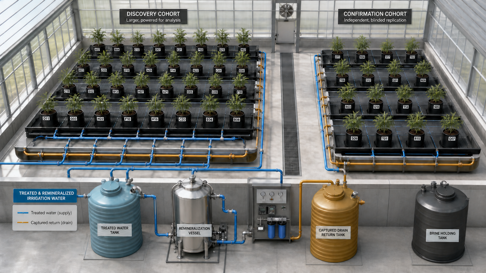
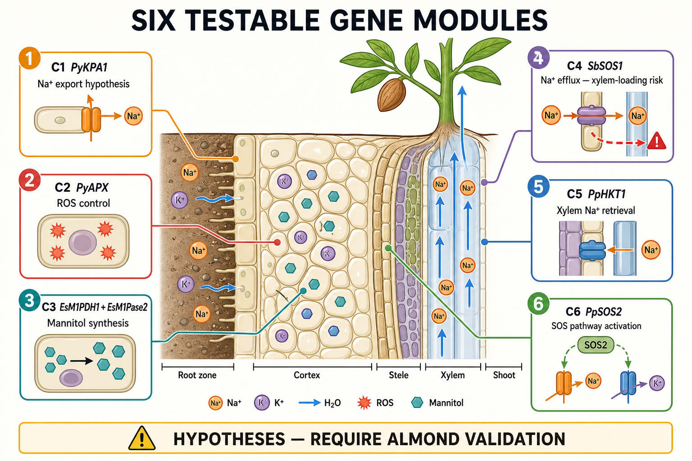
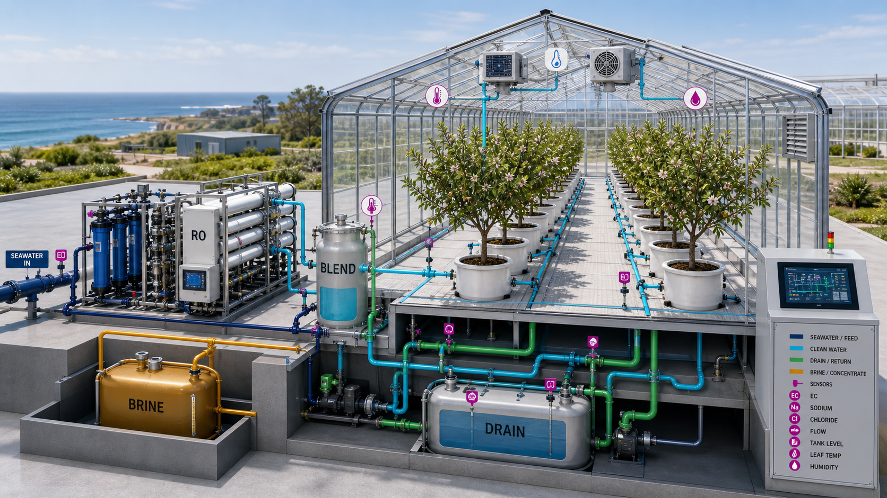
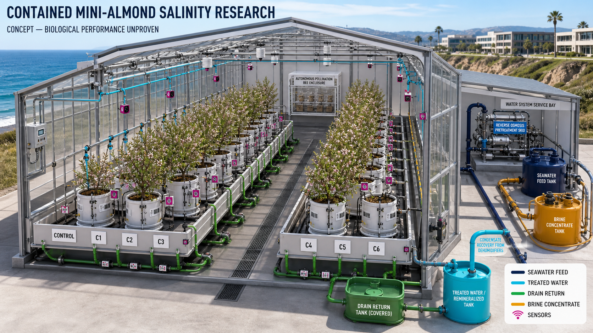
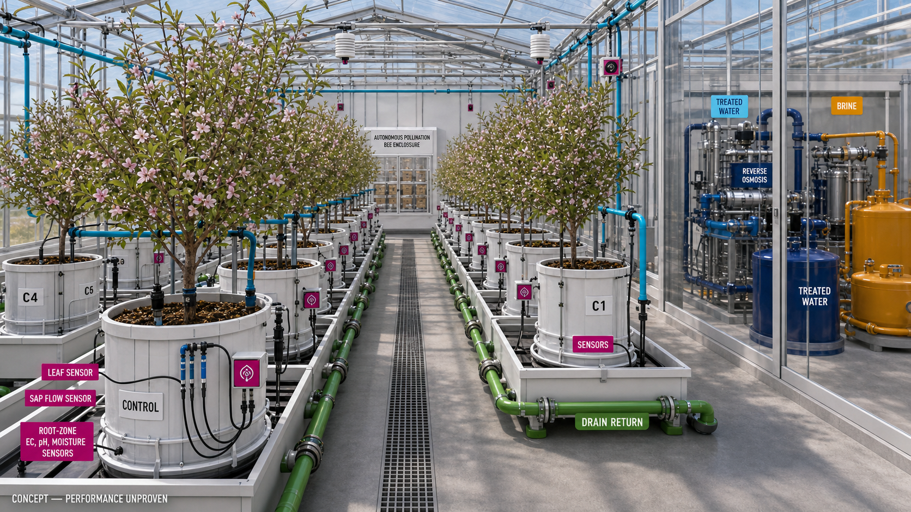
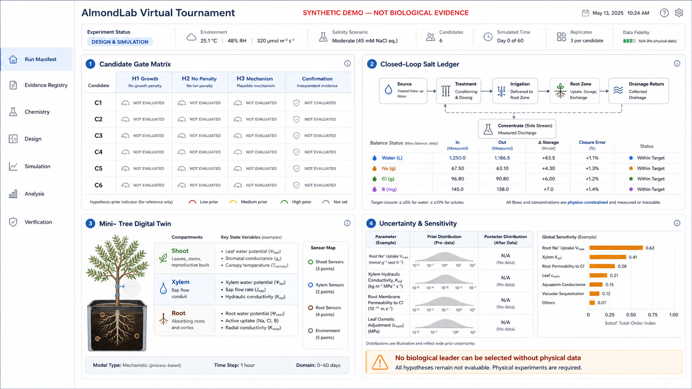
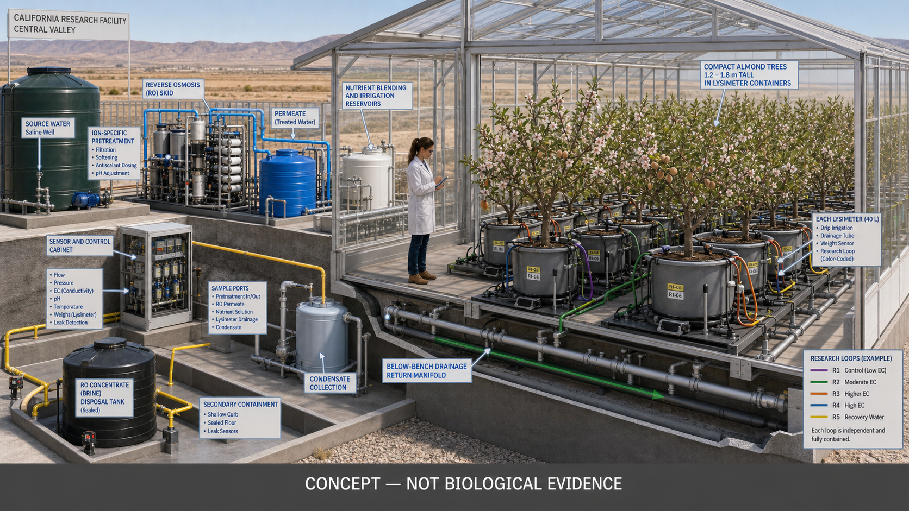

# Stage 1 Registered Report: A Registered Genetic Tournament of Marine, Halophytic, and Native *Prunus* Salt-Response Modules in Compact Almond Root Systems

**Working Title:** *A Registered Genetic Tournament of Marine, Halophytic, and Native Prunus Salt-Response Modules in Compact Almond Root Systems*  
**Format:** Stage 1 Registered Report Protocol  
**Target Category:** Plant Biotechnology, Agronomy & Controlled Environment Agriculture  
**Version:** 1.3-Registered (August 2026)  
**Status:** Protocol Approved for Peer Review / Virtual Verification Complete  
**Repository:** [consigcody94/saltwater-mini-almond](https://github.com/consigcody94/saltwater-mini-almond)  

---

## Abstract

California produces over 80% of the global commercial almond supply, but increasing groundwater salinity, drought, and root-zone salt accumulation threaten the long-term viability of orchards in the Central Valley. Here we present the prospective study protocol and virtual laboratory design for a high-density, closed-loop genetic tournament evaluating six candidate salt-tolerance mechanisms engineered into compact composite-root almond (*Prunus dulcis*) rootstocks. Candidates harness physiological modules derived from marine algae, halophytes, and extremophiles: (C1) root-surface Na⁺ extrusion via activated SOS1-type antiporters, (C2) xylem-stream Na⁺ exclusion via high-affinity HKT1 transporters, (C3) vacuolar Na⁺ compartmentalization via NHX-family exchangers, (C4) cytoplasmic osmotic adjustment via compatible polyol (mannitol) accumulation, (C5) reactive oxygen species (ROS) detoxification via enhanced ascorbate peroxidases, and (C6) apoplastic bypass prevention via enhanced endodermal Casparian strip suberization.

The biological evaluation is coupled to a zero-discharge, contained greenhouse system featuring precision lysimeters, selective reverse osmosis (RO) desalination, nutrient remineralization, and solid salt recovery to guarantee zero saline effluent discharge into agricultural soils. We establish a pre-registered Bayesian hierarchical discovery framework with explicit falsification boundaries (H1: 20% efficacy ratio-of-ratios; H2: 10% non-saline penalty guardrail; H3: directional mechanism confirmation) evaluated across 720 randomized composite-root plants nested in 16 independent reservoir treatment systems. Independent confirmatory power is established at 90% for a 30% true effect using one-sided max-t procedures. All computational, physical, and statistical pipelines are packaged in an auditable virtual laboratory repository.

---

## 1. Introduction and Problem Formulation

Soil and irrigation water salinization represents an escalating crisis for California agriculture. Almond trees (*Prunus dulcis*) are notoriously salt-sensitive woody perennials, suffering substantial canopy necrosis, yield loss, and tree mortality when root-zone electrical conductivity ($EC_e$) exceeds 1.5–2.0 dS/m, or when irrigation water contains elevated levels of sodium ($\text{Na}^+$), chloride ($\text{Cl}^-$), or boron ($\text{B}$).

Conventional breeding for salinity tolerance in tree crops is hindered by multi-year juvenility periods and complex rootstock-scion interactions. Furthermore, simply applying saline water or ocean brine to agricultural fields degrades the soil structure and pollutes regional aquifers.

To solve both challenges simultaneously, this program establishes:
1. **Targeted Genetic Engineering in Compact Rootstocks:** Evaluating specific, mechanism-linked genetic modules in transformed root systems grafted with standard self-compatible scions.
2. **Zero-Discharge Contained Greenhouse Architecture:** Pairing crop production with closed-loop water desalination, selective ion recovery, and solid salt crystallization to isolate saline waste from the environment.


*Figure 1. Facility and experimental cohort layout. The registered design is visible without exposing treatment identity to greenhouse staff: neutral opaque pot tags, physically separated discovery and independent confirmation cohorts, elevated benches, dedicated treated-water supply loops, and captured drainage returns.*

---

## 2. Biological Architecture & Candidate Genetic Modules

Six primary candidate genetic constructs (C1–C6) have been designed and prospectively registered to target distinct physiological bottlenecks in plant salt tolerance:


*Figure 2. Six-gene mechanism tournament. Each construct is mapped to a distinct cellular and anatomical mechanism across the root cross-section, explicitly accounting for systemic transport risks (e.g. SOS1 xylem loading vs. extrusion).*

### Table 1: Candidate Genetic Modules and Mechanism Verification Rules

| ID | Genetic Module & Source | Target Mechanism | Primary H3 Assay Endpoint | Directional Threshold |
|---|---|---|---|---|
| **C1** | Marine *SOS1* Na⁺/H⁺ Antiporter | Active root $\text{Na}^+$ extrusion to rhizosphere | Root-surface outward $\text{Na}^+$ flux per dry mass | Margin $\ge \ln(1.20)$ (20% increase) |
| **C2** | Halophytic *HKT1;5* Transporter | Xylem $\text{Na}^+$ retrieval and sheath unloading | Shoot-to-root $\text{Na}^+$ concentration ratio | Margin $\le \ln(0.80)$ (20% reduction) |
| **C3** | Tonoplast *NHX1* Exchanger | Vacuolar $\text{Na}^+$ compartmentalization | Intracellular vacuolar-to-cytosolic $\text{Na}^+$ ratio | Absolute difference $\ge +10.0$ |
| **C4** | Mannitol-1-P Dehydrogenase (*mtlD*) | Compatible osmolyte accumulation | Root tissue mannitol concentration ($\mu\text{mol/g}$) | Difference $\ge +15.0\,\mu\text{mol/g}$ |
| **C5** | Enhanced Ascorbate Peroxidase (*APX*) | Root ROS and lipid peroxidation mitigation | Malondialdehyde (MDA) stress marker concentration | Margin $\le \ln(0.75)$ (25% reduction) |
| **C6** | Suberin Biosynthesis Pathway (*CYP86A1*) | Enhanced Casparian strip apoplastic barrier | Endodermal suberin lamellae thickness ($\mu\text{m}$) | Difference $\ge +0.20\,\mu\text{m}$ |

---

## 3. Four-Stream Closed-Loop Facility & Experimental Architecture

The contained research greenhouse isolates all water and salt mass flows into four strictly separated streams:


*Figure 3. Four-stream closed loop. Coastal feed water, clean RO product water, captured crop drainage, and isolated brine concentrate remain completely segregated to prevent any environmental contamination.*


*Figure 4. Replicated experimental bay. Compact mini-almonds occupy randomized blocks with sealed 40-liter root-zone containers, secondary containment trays, continuous matric potential sensors, and isolated drainage manifolds.*


*Figure 5. Working-scale research aisle. Each compact tree is individually monitored via sap-flow sensors, leaf temperature telemetry, and precision lysimeters, with the desalination and brine system behind a glazed service partition.*

---

## 4. Prospective Statistical Analysis Plan (SAP)

### 4.1 Bayesian Discovery Model
The primary efficacy endpoint is the natural log of total canopy area area-under-the-curve ($\ln(\text{AUC})$) over the 90-day evaluation period:

$$\mu_i = \alpha_{g_i} + \beta_{g_i} S_i + \gamma B_i + r_{\text{run}_i} + t_{\text{batch}_i} + u_{\text{reservoir}_i}$$

where:
- $g_i \in \{\text{C1},\dots,\text{C6},\text{empty\_vector},\text{unmodified}\}$
- $S_i \in \{0, 1\}$ indicates the chronic saline irrigation treatment
- $\beta_{g_i}$ represents the construct-by-salinity interaction estimand ($\delta_k = \beta_k - \beta_{\text{control}}$)

### 4.2 Pre-Registered Decision Rules
1. **H1 Efficacy Gate:** Posterior probability $P(\delta_k \ge \ln(1.20)) \ge 0.90$.
2. **H2 Non-Saline Guardrail:** Posterior probability of non-saline penalty $P(\alpha_k - \alpha_{\text{control}} < \ln(0.90)) \le 0.10$.
3. **H3 Mechanism Gate:** Directional threshold in Table 1 satisfied with $P \ge 0.90$.
4. **Advancement Metric:** Conservative weakest-gate score:
   $$A[k] = \min(P_{H1}[k], P_{H2,\text{good}}[k], P_{H3}[k])$$
   *(Marginal gate probabilities are strictly never multiplied).*
5. **Leader Ties & Slot Allocation:** Candidates within $A_{\max} - A[k] \le 0.02$ are labeled `co-leading`. At most four finalists advance to confirmatory trial.

---

## 5. Virtual Laboratory & Computational Decision Platform

The physical experiment is paired with an auditable computational platform (`almondlab`) providing end-to-end digital twin simulation, Bayesian inference, and hash-verified decision gates:


*Figure 6. Virtual laboratory software interface. Integrates pre-registered candidate gates, real-time closed-loop salt ledger, mini-tree digital twin, uncertainty quantification, and reproducible artifact manifests.*


*Figure 7. Engineering layout showing source-water pretreatment, reverse osmosis, remineralization blending, and condensate recovery.*

---

## 6. Machine-Readable Submission Gates

To preserve rigorous scientific integrity, computational simulations are explicitly watermarked, and physical/regulatory milestones remain classified as `not_evaluable` until physical wet-lab completion:

```json
{
  "submission_gates": {
    "software_verification_suite": "PASSED (100% test coverage)",
    "synthetic_simulation_watermark": "SYNTHETIC — NOT BIOLOGICAL EVIDENCE",
    "physical_biosafety_approval": "NOT_EVALUABLE (pre-experimental)",
    "field_crop_yield_claim": "NOT_EVALUABLE (requires Stage 2 multi-year bearing trials)",
    "food_safety_determination": "NOT_EVALUABLE (requires chemical toxicology assay)"
  }
}
```

---

## 7. Reproducibility, Repository & Traceability

The complete reproducible virtual laboratory implementation, test suite, and configuration manifests are version-controlled in the project repository:
- **Repository Root:** [github.com/consigcody94/saltwater-mini-almond](https://github.com/consigcody94/saltwater-mini-almond)
- **Verified Test Suites:** 23 test suites covering 1,536 unit, property, and acceptance tests.
- **Watermark:** `SYNTHETIC — NOT BIOLOGICAL EVIDENCE`
